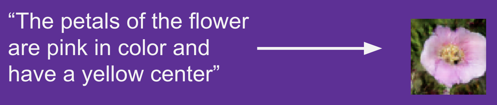
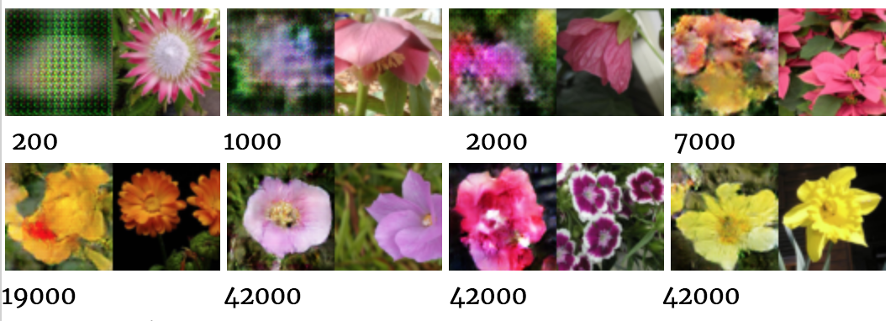
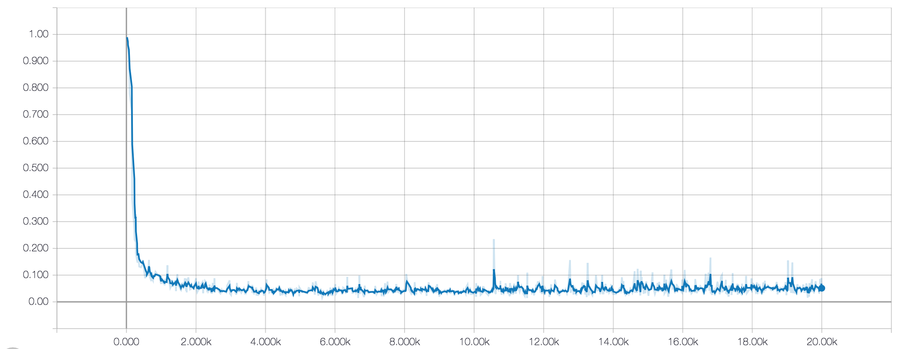
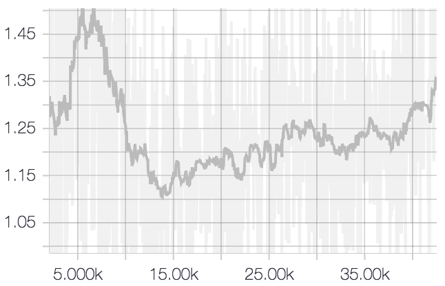
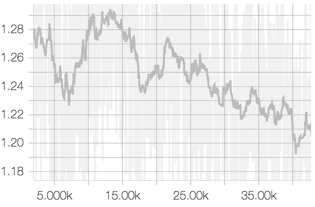

# Text2Image
Text2Image can understand a human written description of an object to generate a realistic 
image based on that description. Text2Image is using a type of generative adversarial network (GAN-CLS), implemented from
 scratch using Tensorflow.

You can also see a progression of GAN training

Our project is primarily based on the works of [Generative Adversarial Text to Image Synthesis [Reed et al, 2016]](http://proceedings.mlr.press/v48/reed16.pdf), 
the training is done in three steps: 
1. Encoding a pretrained GoogLeNet into high dimensional embedding space 
2. Training a text encoder to encode text into same high dimensional embedding space as step1
3. Generative adversarial training on both generator network and discriminator network, feeding in encoded text using encoder
from step 2.

# 
# Training
* Step one: `pre-encode.py` encode images into 1024 dimensional embedding space with GoogLeNet [Reference here]
* Step two: `train_text_encoder.py` to train text encoder into 1024 dim embedding space using encoded images in step 1
* Step three: `trainer_gan.py` to train GAN with the already trained text encoder from step 2. In `conf.py` you can multi GPU support

# Training details

The text encoder was trained on a single Nvidia K80 GPU for 12 hours, 
The GAN was trained on GCP with 4 Nvidia K80 GPUs for about 8 hours. 

This is what the training loss look like:

text encoder (step 2) loss:

Generator (step 3) loss:

Discrimator (also step 3) loss:

# Pretrained models
Please PM me 

# Known issues:
* The text encoder embedding space might not have been normalized properly, because GAN diverges on certain text descriptions.
however a randomly initialized text encoder can almost always ensure stable GAN learning.
